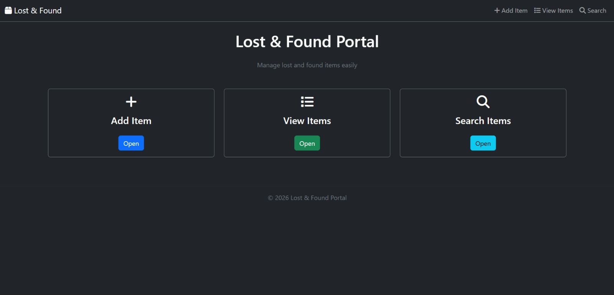
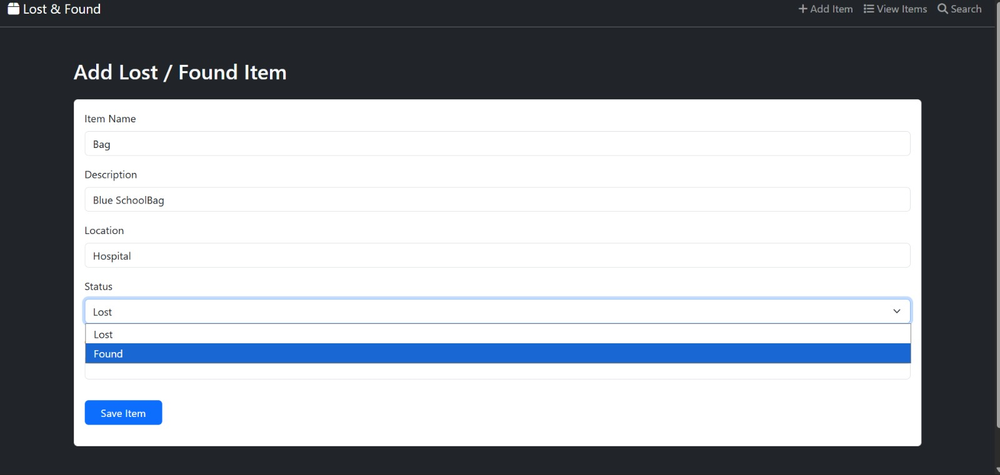
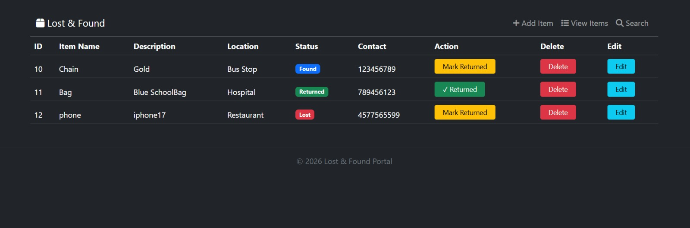
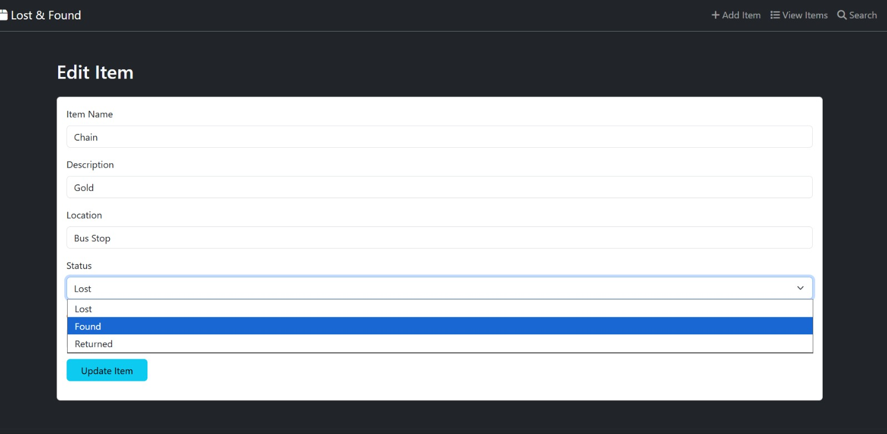
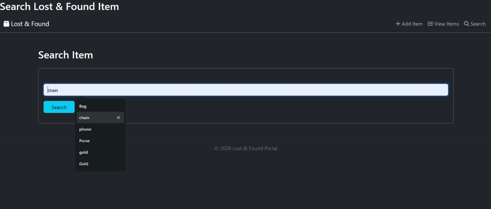

# 🔍 Lost & Found Portal – Spring MVC Web Application

This project is a **Lost & Found Management System** built using **Java, Spring MVC, Hibernate, and MySQL**.
It allows users to **report lost or found items, search for items, update records, and mark items as returned** through a simple web interface.

The application demonstrates the use of **MVC architecture, database integration, and CRUD operations** in a real-world web application scenario.

---

## ✅ Features

* ➕ **Add Lost / Found Item**
  Users can report lost or found items with details such as item name, description, location, and contact information.

* 📋 **View All Items**
  Displays all reported items in a structured table format.

* 🔎 **Search Items**
  Users can search items by name to quickly locate relevant records.

* ✏️ **Edit Item Details**
  Existing records can be updated when new information becomes available.

* ❌ **Delete Item**
  Remove records when they are no longer needed.

* ✔ **Mark Item as Returned**
  Update item status when the item is successfully returned.

* 🎨 **Modern Dark UI**
  Clean user interface built with **Bootstrap and custom CSS**.

---

## 🧠 Technologies Used

* 💻 **Java**
* 🌱 **Spring MVC**
* 🗄 **Hibernate ORM**
* 🛢 **MySQL**
* 🌐 **JSP**
* 🎨 **Bootstrap**
* 📦 **Maven**

---

## 🗃️ Project Structure

This project follows the **standard Maven project structure**:

```
Lost-Found-Portal
│
├── src/main/java
│   ├── controller
│   │     └── ItemController.java
│   │
│   ├── dao
│   │     └── ItemDao.java
│   │
│   └── model
│         └── Item.java
│
├── src/main/resources
│       └── applicationContext.xml
│
├── src/main/webapp
│   ├── index.jsp
│   ├── addItem.jsp
│   ├── editItem.jsp
│   ├── navbar.jsp
│   ├── footer.jsp
│   └── css
│        └── style.css
│
└── pom.xml
```

---

## 🔄 How It Works

1. Open the application in a browser through the configured server.

2. Navigate using the **dashboard menu**:

   * Add Item
   * View Items
   * Search Items

3. Users can:

   * Add new lost or found items
   * Search items by name
   * Update item details
   * Delete records
   * Mark items as returned

4. All data is stored and managed using **MySQL database with Hibernate ORM**.

---

## 📌 Sample Use Cases

| Scenario               | Behavior                       |
| ---------------------- | ------------------------------ |
| User loses an item     | Adds a new **Lost Item** entry |
| Someone finds an item  | Adds a **Found Item** entry    |
| Searching for an item  | User searches by item name     |
| Item returned to owner | Status updated to **Returned** |
| Incorrect record added | User deletes the item          |

---

## ⚠️ Limitations

* Basic UI designed for learning purposes.
* No authentication or user accounts.
* Image upload for items is not implemented.
* Application runs locally.

---

## 📌 Future Enhancements

* 🔐 User authentication system
* 🖼 Item image upload support
* 📱 Responsive mobile-friendly UI
* ☁ Cloud deployment
* 📊 Admin dashboard for monitoring items

---

## 🙌 Acknowledgements

This project was built as part of a learning journey in **Java backend development, Spring MVC architecture, and database integration**.
It demonstrates practical implementation of **CRUD operations in a web-based system**.


## 📸 Project Screenshots










